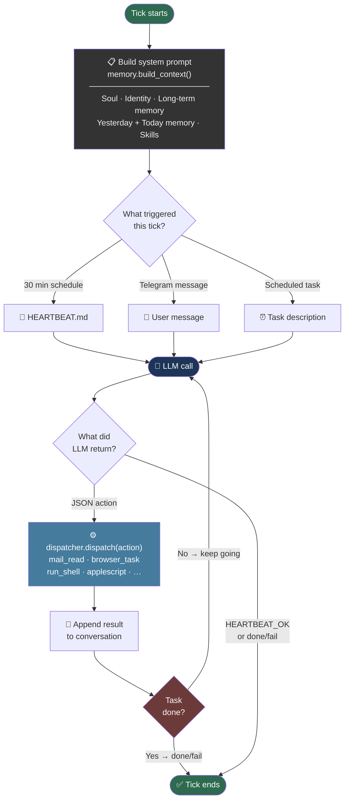

# macgent

**macOS automation agent with an LLM-driven observe → think → act loop, file-based memory, and Telegram control.**

macgent runs as a persistent daemon on your Mac. You talk to it via Telegram; it reads email, manages your calendar, browses the web, runs shell commands, and remembers what it learns — day after day.

> "The soul gives purpose. Memory gives wisdom. Skills give power."

---

## Why

macgent is primarily a **learning project** — a ground-up rebuild in pure, clean Python to deeply understand the design decisions behind tools like [openclaw](https://github.com/anthropics/claude-code) and why they work the way they do.

Building it from scratch forces you to confront the real problems: how to structure memory so an agent stays coherent across days, how to keep the system prompt lean, when to let the LLM decide vs when to hard-code logic (spoiler: almost always let the LLM decide), and how to make the whole thing debuggable.

If you're looking for a production-ready alternative, check out **[NanoBot](https://github.com/openclaw/nanobot)** — what I am using currently for my personal automation needs.

---

## Setup

**Requirements:** Python 3.14+, [uv](https://github.com/astral-sh/uv), macOS (Mail, Calendar, Messages apps)

```bash
git clone https://github.com/yourusername/macgent
cd macgent
uv sync
playwright install chromium     # browser automation
cp .env.example .env
cp macgent_config.json.example macgent_config.json
```

Edit `.env`:
```env
OPENROUTER_API_KEY=sk-...          # or any OpenAI-compatible provider
TELEGRAM_BOT_TOKEN=...             # from @BotFather
TELEGRAM_CHAT_ID=...               # from @userinfobot
BRAVE_SEARCH_API_KEY=...           # optional, for web search
```

Edit `macgent_config.json` to define model routing:
```json
{
  "providers": {
    "openrouter": {
      "api_base": "https://openrouter.ai/api/v1",
      "api_type": "openai",
      "api_key_env": "OPENROUTER_API_KEY"
    }
  },
  "offers": {
    "text":   { "main": { "provider": "openrouter", "model": "qwen/qwen3-coder:free" } },
    "vision": { "main": { "provider": "openrouter", "model": "nvidia/nemotron-nano-12b-v2-vl:free" } }
  },
  "routes": {
    "text":    { "primary": "main", "fallbacks": [] },
    "vision":  { "primary": "main", "fallbacks": [] },
    "browser": { "text": { "primary": "main" }, "vision": { "primary": "main" } }
  },
  "runtime": { "workspace_dir": "/path/to/workspace" },
  "integrations": {
    "telegram_bot_token_env": "TELEGRAM_BOT_TOKEN",
    "telegram_chat_id_env": "TELEGRAM_CHAT_ID"
  }
}
```

First run (setup wizard + one bootstrap heartbeat):
```bash
uv run macgent
```

---

## Running

```bash
# Daemon mode — runs forever, wakes on Telegram or schedule
uv run macgent daemon

# One heartbeat then exit (useful for testing)
uv run macgent daemon --once

# Run a single task directly (no daemon)
uv run macgent 'Read my last 5 emails and summarise them'

# View recent log
uv run macgent log -n 50

# Edit the agent's soul
uv run macgent soul edit agent
```

---

## How It Works

### Agent Loop

Every agent "tick" is a **multi-turn LLM conversation**. The agent keeps acting until it signals it's done.



### Dual Heartbeat

Two loops run in parallel inside the daemon:

| Loop | Interval | What it does |
|------|----------|--------------|
| **Agent heartbeat** | 30 min (configurable) | LLM-driven tick — reads Notion/email/messages, responds, executes tasks |
| **System pulse** | 60 s (configurable) | Python-only — workday file maintenance, fires scheduled wakeups from `PULSE_SCHEDULE.json` |

The daemon also polls for Telegram messages every 500 ms and wakes early when one arrives.

---

## Context & Memory

On every tick, `MemoryManager.build_context()` assembles the system prompt from these layers, in order:

```
# Current Date & Time
2026-03-07 09:30 (Saturday)

---

# Soul
workspace/agent/SOUL.md          ← personality, workspace layout, skill index

---

# Identity
workspace/agent/IDENTITY.md      ← agent's name, communication style (written during bootstrap)

---

# Long-term Memory
workspace/agent/memory/LONGTERM_MEMORY.md   ← distilled lessons from past workdays

---

# Yesterday's Memory (2026-03-06)
workspace/agent/memory/2026-03-06_MEMORY.md

---

# Today's Memory (2026-03-07)
workspace/agent/memory/2026-03-07_MEMORY.md

---

# Skills
macgent/skills/*.md              ← core skills (always loaded)
workspace/skills/*.md            ← learned/environment-specific skills
```

The agent can append to today's memory file via `memory_append` actions — this is how it learns during a session. Nightly distillation (agent-scheduled via `PULSE_SCHEDULE.json`) condenses daily notes into `LONGTERM_MEMORY.md`.

**Workday boundary:** 04:00. Before 4 AM you're still on the previous workday. Daily files older than 2 workdays are auto-deleted.

---

## Available Actions

### macOS Native (via AppleScript)
| Action | Description |
|--------|-------------|
| `mail_read` | List inbox messages `{"limit": 10}` |
| `mail_read_message` | Full email body `{"number": 1}` |
| `mail_send` | Send email `{"to", "subject", "body"}` |
| `mail_reply` | Reply to message `{"number", "body"}` |
| `calendar_read` | Read events for a date |
| `calendar_add` | Create calendar event |
| `imessage_read` | Read iMessages `{"contact", "limit"}` |
| `imessage_send` | Send iMessage `{"contact", "text"}` |
| `applescript` | Run arbitrary AppleScript |

### Screen & Input
| Action | Description |
|--------|-------------|
| `mouse_click` / `mouse_move` / `mouse_double_click` | Mouse control |
| `key_press` / `type_string` | Keyboard control |
| `screenshot` | Capture screen to workspace |
| `screenshot_grid` | Screenshot with coordinate grid burned in |
| `locate_in_app` | Vision-assisted UI element finder |
| `evaluate_image` | Send image to vision model |
| `open_app` | Launch macOS application |

### Web
| Action | Description |
|--------|-------------|
| `browser_task` | Delegate full browsing task to Playwright agent |
| `brave_search` | Fast API-based web search (no browser needed) |

### Data
| Action | Description |
|--------|-------------|
| `notion_query` / `notion_get` / `notion_update` / `notion_create` / `notion_schema` | Notion database |

### Shell
| Action | Description |
|--------|-------------|
| `run_shell` | Run command in persistent tmux session (`macgent_shell`) |
| `run_script` | Run a script file from workspace |

### Control
| Action | Description |
|--------|-------------|
| `done` | Signal task complete `{"summary": "..."}` |
| `fail` | Signal task failed `{"reason": "..."}` |
| `wait` | Sleep `{"seconds": N}` |

---

## Bootstrap Flow

On first run, `workspace/agent/IDENTITY.md` does not exist. The agent detects this and runs a one-time bootstrap:

```
SOUL.md → system prompt
BOOTSTRAP.md → user prompt
    │
    ▼  LLM multi-turn (up to 15 turns)
    ├─ send_telegram: introduces itself, asks 3 questions
    ├─ file_write: creates USER.md
    ├─ file_write: creates IDENTITY.md  ← marks bootstrap complete
    └─ file_delete: deletes BOOTSTRAP.md
    │
    ▼  HEARTBEAT_OK → bootstrap done, daemon enters normal schedule
```

---

## Workspace Layout

```
workspace/
  agent/
    SOUL.md             ← agent personality & workspace index
    IDENTITY.md         ← written by agent at bootstrap
    HEARTBEAT.md        ← heartbeat instructions
    USER.md             ← user profile
    TELEGRAM_COMMANDS.md
    memory/
      CORE_MEMORY.md    ← memory policy contract
      LONGTERM_MEMORY.md
      YYYY-MM-DD_MEMORY.md   ← daily rolling log
    PULSE_SCHEDULE.json ← agent-configured wakeup schedule
    PULSE_STATE.json    ← pulse idempotency tracker
  skills/
    *.md                ← learned/env-specific skill docs
  scripts/
    *.py                ← runnable scripts
  inbox/
    telegram/           ← downloaded Telegram attachments
```

---

## Telegram Commands

Once the daemon is running, message your bot:

- Any natural language → processed as a user message, agent acts immediately
- The agent can reply, ask follow-up questions, or confirm completed tasks
- You can send files/images; they're saved to `workspace/agent/inbox/telegram/`

---

## Logs

Daily log files in `logs/macgent-YYYY-MM-DD.log`. LLM prompt/response blocks are written to the file but filtered from the console. Use `--show-llm` to see them in terminal, `--debug` for full DEBUG output.

```bash
uv run macgent log -n 100
tail -f logs/macgent-$(date +%Y-%m-%d).log
```
